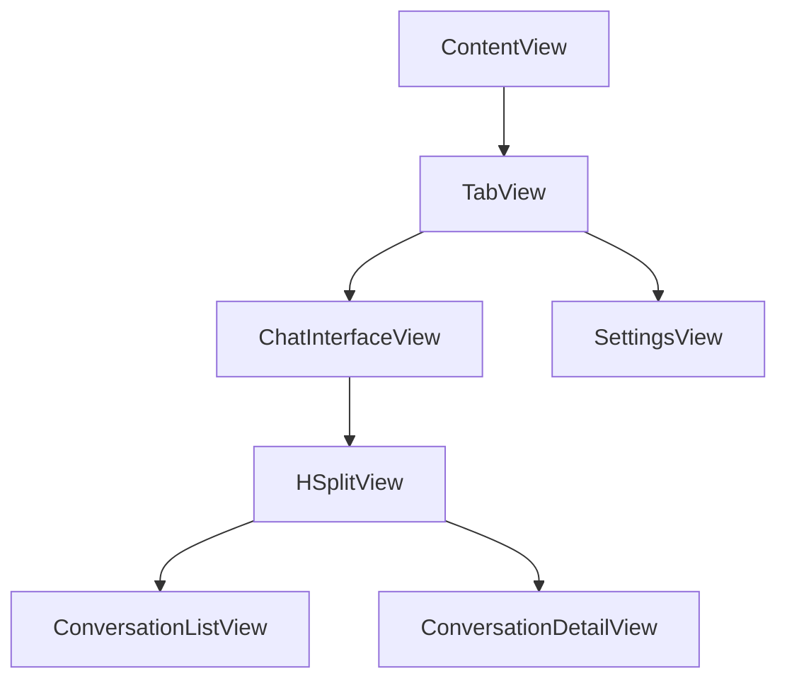
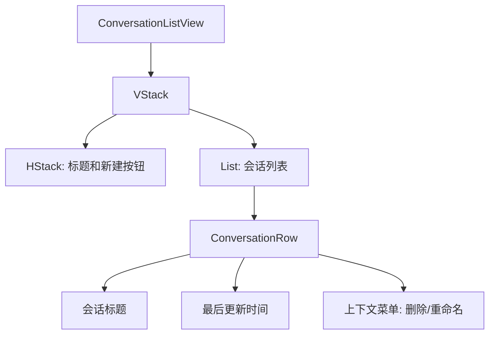
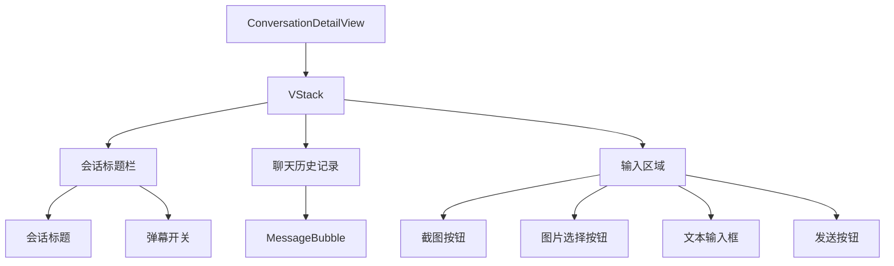

# AI-Encouragement-Barrage UI升级计划

根据您的需求，我将设计一个全面的UI升级计划，将聊天界面改造为左右分开的布局，支持多个聊天会话，并保留弹幕功能。以下是详细的升级计划：

## 1. 数据模型升级

首先，我们需要创建一个新的数据模型来支持多个聊天会话。

### 新增 Conversation 模型

```swift
@Model
final class Conversation {
    var id: UUID
    var title: String
    var createdAt: Date
    var updatedAt: Date
    var messages: [ChatMessage]
    
    init(title: String = "新对话", messages: [ChatMessage] = []) {
        self.id = UUID()
        self.title = title
        self.createdAt = Date()
        self.updatedAt = Date()
        self.messages = messages
    }
}
```

### 修改 ChatMessage 模型

需要修改现有的ChatMessage模型，使其与Conversation关联：

```swift
@Model
final class ChatMessage {
    var id: UUID
    var text: String
    var isFromUser: Bool
    var timestamp: Date
    var imageData: Data?
    
    // 新增关系
    @Relationship(inverse: \Conversation.messages)
    var conversation: Conversation?
    
    init(text: String, isFromUser: Bool, imageData: Data? = nil) {
        self.id = UUID()
        self.text = text
        self.isFromUser = isFromUser
        self.timestamp = Date()
        self.imageData = imageData
    }
}
```

### 更新 AppState 模型

```swift
class AppState: ObservableObject {
    // 现有属性
    @Published var isRunning: Bool = false
    @Published var isProcessing: Bool = false
    @Published var lastEncouragement: String = ""
    @Published var lastCaptureTime: Date? = nil
    @Published var shouldTestBarrages: Bool = false
    @Published var barrageService: BarrageService?
    
    // 新增属性
    @Published var selectedConversationID: UUID? = nil
    
    // 现有方法...
    
    // 新增方法
    func selectConversation(_ id: UUID?) {
        self.selectedConversationID = id
    }
}
```

## 2. UI 组件设计

### 主界面布局 (ContentView)

修改ContentView，使其支持左右分开的布局：



### 会话列表视图 (ConversationListView)

左侧显示聊天会话列表，包含：
- 会话标题
- 最后更新时间
- 新建按钮
- 删除功能

### 会话详情视图 (ConversationDetailView)

右侧显示选中会话的详细内容，包含：
- 聊天历史记录
- 消息输入区域
- 弹幕控制开关
- 截图和图片上传功能

## 3. 功能实现计划

### 第一阶段：数据模型实现

1. 创建Conversation模型
2. 修改ChatMessage模型，建立与Conversation的关系
3. 更新AppState，添加会话选择状态

### 第二阶段：UI组件实现

1. 创建ConversationListView组件
2. 创建ConversationDetailView组件
3. 修改ContentView，使用HSplitView实现左右分开布局

### 第三阶段：功能实现

1. 实现新建会话功能
2. 实现会话选择功能
3. 实现会话删除功能
4. 将弹幕控制集成到聊天界面

### 第四阶段：数据迁移

1. 创建数据迁移助手，将现有聊天记录迁移到新的数据模型中
2. 确保现有功能与新UI兼容

## 4. 详细UI设计

### ConversationListView



### ConversationDetailView



## 5. 颜色主题

遵循macOS系统风格，使用系统提供的颜色：
- 背景色：Color(.windowBackgroundColor)
- 文本颜色：Color(.labelColor)
- 次要文本：Color(.secondaryLabelColor)
- 分隔线：Color(.separatorColor)
- 强调色：Color(.controlAccentColor)

## 6. 实现步骤

1. 创建新的数据模型
2. 实现基本UI组件
3. 实现会话管理功能
4. 集成弹幕控制
5. 测试和优化

## 7. 界面预览

### 主界面布局

左侧是会话列表，右侧是当前选中会话的详细内容。整体布局类似于邮件客户端或现代聊天应用。

左侧会话列表：
- 顶部有新建按钮
- 每个会话项显示标题和最后更新时间
- 选中的会话高亮显示

右侧会话详情：
- 顶部显示会话标题和弹幕控制开关
- 中间是消息历史，支持文本和图片
- 底部是输入区域，包含截图、选择图片、文本输入和发送按钮

### 消息气泡设计

- 用户消息靠右显示，使用系统强调色背景
- AI回复靠左显示，使用浅灰色背景
- 图片消息显示在气泡内，可点击放大
- 每条消息显示发送时间

## 8. 数据迁移策略

为了确保现有用户数据的平滑过渡，我们将实现以下迁移策略：

1. 首次启动新版本时，检测是否存在旧版本数据
2. 如果存在，创建一个默认会话，并将所有现有ChatMessage导入到这个会话中
3. 设置这个默认会话为当前选中会话

这样可以确保用户的历史聊天记录不会丢失，同时平滑过渡到新的UI模式。